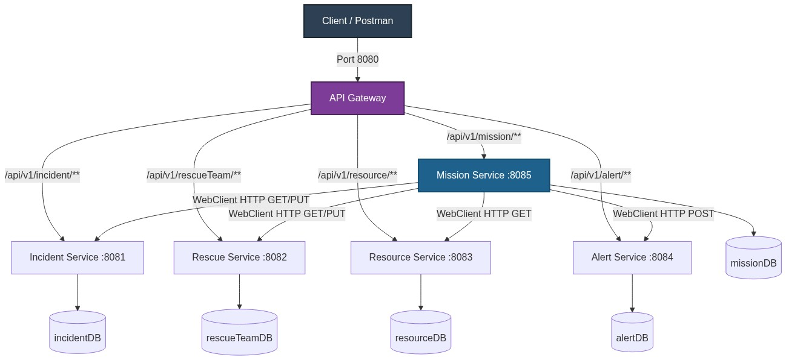
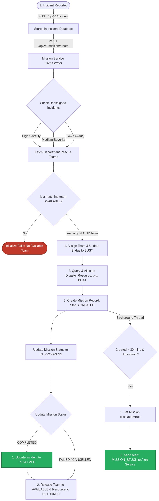

# 🚨 Smart Disaster Response Coordination System

<p align="center">


</p>

> An **Orchestration-Based Microservices Smart Disaster Response Coordination System** built using **Java 17**, **Spring Boot**, **Spring Data JPA**, **MySQL**, **Spring Cloud Gateway**, and **Spring WebFlux (Reactive WebClient)**. The system coordinates emergency responses to disasters (such as Fire, Flood, Cyclone, Earthquake, and Tsunami) by automatically selecting priority incidents, assigning matching rescue teams, allocating appropriate resources, and monitoring status. It also features a background scheduler to escalate unresolved missions and generate alerts.

---

# 📚 Table of Contents

- [Overview](#-overview)
- [Project Highlights](#-project-highlights)
- [System Architecture](#-system-architecture)
- [Technology Stack](#-technology-stack)
- [Microservices](#-microservices)
- [Project Structure](#-project-structure)
- [Business Workflow](#-business-workflow)
- [API Endpoints](#-api-endpoints)
- [Database Architecture](#-database-architecture)
- [Business Rules](#-business-rules)
- [Validation](#-validation)
- [Exception Handling](#-exception-handling)
- [Known Technical Notes](#-known-technical-notes)
- [Installation](#-installation)
- [Running the Project](#-running-the-project)
- [Future Enhancements](#-future-enhancements)
- [Author](#-author)

---

# 📖 Overview

The **Smart Disaster Response Coordination System** handles critical emergency dispatches during natural and man-made disasters. 

The platform is developed using **Spring Boot Microservices** following the **Database per Microservice** pattern, keeping services decoupled and independently deployable. 

The **Mission Service** acts as the orchestrator. When a mission is initialized, it calls the other services using **Spring WebFlux's WebClient** to retrieve reported incidents, query available rescue teams, update team statuses to busy/available, allocate resources from inventories, and trigger alerts for stuck or delayed missions.

---

# ✨ Project Highlights

- 🚨 **Incident Dispatch**: Report, read, update, and manage emergency incident logs.
- 🚒 **Rescue Team Management**: Register rescue teams, track locations, departments, and real-time availability statuses.
- 📦 **Resource & Inventory Tracking**: Keep tabs on specific relief resources (e.g. fire extinguishers, boats, life jackets, medical kits) and their quantities at various locations.
- 🎯 **Automated Mission Initialization**: Smart dispatch logic that automatically pulls the highest priority unresolved incidents and links them with a matching department team and resource.
- ⏰ **Background Escalation**: A scheduled monitor that automatically flags unresolved missions and publishes emergency alerts.
- 🌐 **Centralized Gateway Routing**: Spring Cloud Gateway configuration to handle request routing across all microservices.
- ✅ **Robust Validation**: Strong request body checks using Jakarta Validation constraints.
- ⚠️ **Centralized Global Exception Handling**: Consistent Error DTO responses across all services.

---

# 🏗️ System Architecture



---

# 🛠 Technology Stack

| Category | Technology |
|-----------|------------|
| Language | Java 17 |
| Framework | Spring Boot 3.x, Spring Cloud Gateway |
| Database | MySQL 8.0 |
| ORM | Spring Data JPA, Hibernate |
| Build Tool | Maven |
| Async Communication | Reactive WebClient (WebFlux) |
| Mapper | MapStruct |
| Validation | Jakarta Validation |
| Boilerplate Reduction | Lombok |

---

# 🧩 Microservices

| Service | Port | Base Routing Path |
|----------|------|-------------------|
| **API Gateway** | 8080 | `/` |
| **Incident Service** | 8081 | `/api/v1/incident` |
| **Rescue Service** | 8082 | `/api/v1/rescueTeam` |
| **Resource Service** | 8083 | `/api/v1/resource` |
| **Alert Service** | 8084 | `/api/v1/alert` |
| **Mission Service** | 8085 | `/api/v1/mission` |

---

# 📁 Project Structure

```
Smart-Disaster-Response-Coordination-System
│
├── Backend
│   ├── API-gateway
│   │   └── Gateway
│   │
│   ├── Alert-Service
│   │   └── Alert-Service
│   │
│   ├── Incident-Service
│   │   └── Incident-Service
│   │
│   ├── Mission-Service
│   │   └── Mission-Service
│   │
│   ├── Rescue-Service
│   │   └── Rescue-Service
│   │
│   └── Resource-Service
│       └── Resource-Service
└── README.md
```

---

# ⚙️ Business Workflow



### Coordination Logic

1. **Mission Creation**:
   - The user triggers the `/create` endpoint.
   - The system checks all unassigned incident reports and prioritizes them by severity (`HIGH` -> `MEDIUM` -> `LOW`).
   - A new Mission is registered.
   - An available rescue team matching the department specialized for the disaster is assigned, and its status is updated to `BUSY`.
   - A disaster-specific resource (e.g. `BOAT` for `FLOOD`) is allocated from the resource database.
2. **Mission Progression**:
   - The mission is updated to `IN_PROGRESS`.
3. **Mission Completion**:
   - When marked `COMPLETED`, the system updates the original incident report status to `RESOLVED` and releases the rescue team status back to `AVAILABLE`.
4. **Mission Failure/Cancellation**:
   - If marked `FAILED` or `CANCELLED`, the incident remains unresolved, but assigned assets (rescue team and resources) are released.
5. **Auto-Escalation**:
   - A background scheduler checks every 60 seconds for unresolved missions created more than 30 minutes ago.
   - If found, it marks them as `escalated` and generates a `MISSION_STUCK` alert inside the Alert Service.

---

# 📡 API Endpoints

## Incident Service

| Method | Endpoint | Description |
|---------|----------|-------------|
| POST | `/api/v1/incident` | Report a new incident |
| GET | `/api/v1/incident` | Get all incidents |
| GET | `/api/v1/incident/{incidentId}` | Get incident details |
| PUT | `/api/v1/incident/{incidentId}` | Update incident details |
| DELETE | `/api/v1/incident/{incidentId}` | Delete an incident |

---

## Rescue Service

| Method | Endpoint | Description |
|---------|----------|-------------|
| POST | `/api/v1/rescueTeam` | Register a new rescue team |
| GET | `/api/v1/rescueTeam` | Get all rescue teams |
| GET | `/api/v1/rescueTeam/{rescueId}` | Get rescue team details |
| PUT | `/api/v1/rescueTeam/{rescueId}` | Update rescue team |
| DELETE | `/api/v1/rescueTeam/{rescueId}` | Delete a rescue team |

---

## Resource Service

| Method | Endpoint | Description |
|---------|----------|-------------|
| POST | `/api/v1/resource` | Define a new resource category |
| GET | `/api/v1/resource` | Get all resource definitions |
| GET | `/api/v1/resource/{resourceId}` | Get resource definition by ID |
| PUT | `/api/v1/resource/{resourceId}` | Update resource details |
| DELETE | `/api/v1/resource/{resourceId}` | Delete resource definition |
| POST | `/api/v1/resource/inventory` | Create inventory stock |
| GET | `/api/v1/resource/inventory` | List all inventory stocks |
| GET | `/api/v1/resource/inventory/{inventoryId}` | Get inventory stock details |
| PUT | `/api/v1/resource/inventory/{inventoryId}` | Update inventory quantities |
| DELETE | `/api/v1/resource/inventory/{inventoryId}` | Delete inventory stock |

---

## Alert Service

| Method | Endpoint | Description |
|---------|----------|-------------|
| POST | `/api/v1/alert` | Log a new alert |
| GET | `/api/v1/alert` | Retrieve all alerts |
| GET | `/api/v1/alert/{alertId}` | Retrieve a specific alert |
| PUT | `/api/v1/alert/{alertId}` | Update alert details / Acknowledge alert |
| DELETE | `/api/v1/alert/{alertId}` | Delete alert |

---

## Mission Service

| Method | Endpoint | Description |
|---------|----------|-------------|
| POST | `/api/v1/mission/create` | Automatically initialize a mission |
| PUT | `/api/v1/mission/update/{missionId}` | Update mission status |
| GET | `/api/v1/mission` | List all initialized missions |
| GET | `/api/v1/mission/{missionId}` | Get specific mission details |
| GET | `/api/v1/mission/resources/{missionId}`| Get resources allocated to a mission |
| GET | `/api/v1/mission/teams/{missionId}` | Get rescue team allocated to a mission |

---

# 🗄️ Database Architecture

Following the **Database per Microservice** pattern, each microservice maintains a dedicated schema in MySQL.

```
Incident Service   ──────►  incidentDB
Rescue Service     ──────►  rescueTeamDB
Resource Service   ──────►  resourceDB
Alert Service      ──────►  alertDB
Mission Service    ──────►  missionDB
```

---

# 📋 Business Rules

- **Disaster Specialization**: Emergency calls match to department teams as follows:
  - `FIRE` -> `FIRE` department
  - `FLOOD` -> `FLOOD` department
  - `CYCLONE` -> `CYCLONE` department
  - `EARTHQUAKE` -> `EARTHQUAKE` department
  - `TSUNAMI` -> `TSUNAMI` department (default fallback)
- **Equipment/Resource Matching**:
  - `FIRE` -> `FIRE_EXTINGUISHER`
  - `FLOOD` -> `BOAT`
  - `CYCLONE` -> `LIFE_JACKET`
  - `EARTHQUAKE` -> `FIRST_AID_KIT`
  - Default -> `DRINKING_WATER`
- **Asset Allocation**:
  - Teams assigned to active missions have status updated to `BUSY`.
  - Allocated resources are set with status `RECEIVED`.
- **Completion Release**:
  - Completing, failing, or cancelling a mission immediately updates the team status back to `AVAILABLE`.
  - Mission resource status is transitioned to `RETURNED`.
  - If completed, the original incident is resolved.
- **Escalation**: Any active mission created > 30 minutes ago is automatically escalated and sends an alert.

---

# ✔️ Validation

Bean validation is implemented using **Jakarta validation constraints**:

- **Incident Data**: Checks for valid mobile numbers (starting with 6-9 and length of 10), alphabetic characters in names, non-blank locations, and non-null enum values (disaster type, severity, status).
- **Rescue Team Data**: Checks for valid team names (alphanumeric, spaces, dots, hyphens, underscores), locations, statuses, and departments.
- **Resource Inventory Constraints**: Total and reserved quantities cannot be null, and reserved quantity cannot exceed the total quantity.

---

# ⚠️ Exception Handling

Centralized `@ControllerAdvice` classes handle errors and return formatted `ErrorResponseDto` payloads.

Custom exceptions include:
- `IncidentNotFoundException`
- `TeamNotFoundException`
- `ResourceNotFoundException`
- `MissionNotFoundException`
- `NoAvailableTeamException`
- `AlertNotFoundException`

---


# 💻 Installation

Clone the repository:

```bash
git clone https://github.com/DhanushkumarSiv/Smart-Disaster-Response-Coordination-System.git
cd Smart-Disaster-Response-Coordination-System
```

Create the required MySQL databases:

```sql
CREATE DATABASE incidentDB;
CREATE DATABASE rescueTeamDB;
CREATE DATABASE resourceDB;
CREATE DATABASE alertDB;
CREATE DATABASE missionDB;
```

Configure database credentials (`username` and `password`) inside each service's `application.properties` configuration:

```properties
spring.datasource.username=your_username
spring.datasource.password=your_password
```

---

# ▶️ Running the Project

Start the microservices in the following logical order:

1. **MySQL Server** (make sure databases are created)
2. **Incident Service** (Port 8081)
3. **Rescue Service** (Port 8082)
4. **Resource Service** (Port 8083)
5. **Alert Service** (Port 8084)
6. **Mission Service** (Port 8085)
7. **API Gateway** (Port 8080)

Send client API requests (e.g. via Postman) directly to the API Gateway:
```
http://localhost:8080
```

---

# 🔮 Future Enhancements

- 🔐 **Spring Security**: Add JWT token validation at the API Gateway level.
- 🐳 **Dockerization**: Create Dockerfiles and a `docker-compose.yml` configuration to launch the entire stack.
- 🔭 **Eureka Service Discovery**: Integrate Spring Cloud Eureka for dynamic service routing.
- 🛡️ **Resilience4j**: Add Circuit Breakers and Fallbacks for inter-service calls.
- 📨 **Apache Kafka Integration**: Implement event-driven choreography to replace synchronous WebClient orchestration with decoupled publish/subscribe topics.
- 📊 **Monitoring**: Integrate Prometheus and Grafana metrics dashboard.
- 📧 **Websockets / Notifications**: Add real-time SMS/Email notification capabilities.

---

# 👨‍💻 Author

**Dhanushkumar Sivakumar**

---

# ⭐ Support

If you found this project useful, consider giving it a ⭐ on GitHub.

---

# 📄 License

This project is licensed under the [MIT License](LICENSE) - see the [LICENSE](LICENSE) file for details.
